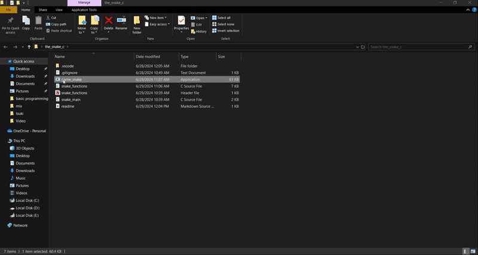

# Snake Game in C

This repository contains the source code for a classic snake game implemented in C. The game is played in a console window and follows the traditional rules of the snake game: eat the food, grow longer, and avoid running into walls or yourself.



## Features

- Classic snake game mechanics
- Simple console-based graphics
- Score tracking
- Adjustable game speed

## Getting Started

### Prerequisites

To compile and run this project, you will need:

- A C compiler (like `gcc`)
- A terminal or command prompt

### Compilation

To compile the game, open a terminal or command prompt and navigate to the directory containing the source code. Then, run the following command:

```sh
gcc -o snake snake.c
